<div align="center">

<!-- Animated Header 

-->
<!-- Typing Animation -->
<p align="center">
  
</p>

<!-- Social Badges -->
<p align="center">
  <a href="https://www.linkedin.com/in/harshita-singh-996853232/">
    
  </a>
  <a href="mailto:harshita.singh4791@gmail.com">
    
  </a>
  <a href="https://github.com/HS-4791">
    
  </a>
  <a href="https://github.com/HS-4791/HS-4791/blob/main/Harshita_Singh_Resume.pdf">
    
  </a>
</p>

<!-- Quick Stats -->
<p align="center">
  
  
  
  
</p>

<!-- Profile Views -->
<p align="center">
  
</p>

</div>

---

## 📊 **About Me**

```python
class DataScientist:
    def __init__(self):
        self.name = "Harshita Singh"
        self.role = "AI & Data Science Engineer"
        self.education = "PGP in AI & Data Science @ Jio Institute"
        self.location = "Mumbai, India"
        
    def say_hi(self):
        print("Thanks for dropping by! Let's build something impactful together.")
    
    def get_expertise(self):
        return {
            "domains": ["Machine Learning", "Generative AI", "Computer Vision", "NLP"],
            "passion": "Transforming data into actionable insights",
            "drive": "Continuous learning & mastering emerging technologies",
            "goal": "Building real-world solutions that matter"
        }

me = DataScientist()
me.say_hi()
```

<div align="center">

### **∫(Passion + Data)dTech = Innovation**

**P(Success | Skills ∩ Dedication) → 1**

</div>

---

## 🛠️ **Tech Stack**

<div align="center">

### **Languages**


### **AI/ML Frameworks & Libraries**


### **Generative AI & LLMs**


### **Data Engineering & Big Data**


### **MLOps & Deployment**


### **Data Visualization & Analysis**


### **Tools & Platforms**


</div>

---

## 💼 **Professional Experience**

### **Decision Analytics Associate** @ [ZS Associates](https://www.zs.com/)
**`Jul 2023 - Sep 2024 | 14 Months`**


- ⚡ **Optimized data workflows** in Dataiku DSS, improving raw-to-final data transformation efficiency by **30%**
- 📊 **Analyzed healthcare data** using Excel, SQL, and Tableau to drive strategic business decision-making
- 🤝 **Delivered end-to-end analytics projects** with direct client interaction, ensuring high-quality deliverables on tight deadlines
- 💡 Collaborated with cross-functional teams to translate complex data insights into actionable business strategies

---

### **Automation Intern** @ [Yes Bank](https://www.yesbank.in/)
**`Oct 2025 - Nov 2025`**


- 🤖 **Built end-to-end financial data pipeline**, reducing manual data collection by **90%**
- 🌐 **Automated web scraping** from 15+ bank websites using Make, Apify, and Nanonet
- 📈 **Integrated AI tools and APIs** to extract, clean, and structure financial data
- 📊 **Generated real-time financial insights** with automated interactive charts and reports

---

## 🚀 **Featured Projects**

<details open>
<summary><b>📄 Document Layout Analysis using YOLOv8 & DocLayNet</b></summary>
<br>

**`Deep Learning • Computer Vision • Object Detection`** | **Jul 2025 - Aug 2025**

Developed an intelligent Document Layout Analysis system for detecting 11 layout elements in complex documents.

**🎯 Key Achievements:**
- Fine-tuned YOLOv8 model on **80K+ image DocLayNet dataset** using PyTorch
- Achieved **92.5% mAP@50** accuracy for precise layout detection
- Deployed production-ready **Flask web application** for real-time inference
- Enabled OCR/NLP fusion for advanced document understanding

**🛠️ Tech Stack:**


[](https://github.com/HS-4791/Document-Layout-Analysis)

</details>

<details>
<summary><b>🌍 AI Trip Planner - Agentic AI Application</b></summary>
<br>

**`Generative AI • Agentic AI • LLMs`** | **Aug 2025 - Sep 2025**

Built an intelligent AI-powered travel planning agent with multi-step reasoning and real-time data integration.

**🎯 Key Achievements:**
- Developed **LLM-powered intelligent agent** using LangGraph and LangChain with tool calling
- Integrated **real-time APIs** (Tavily, OpenWeatherMap) for dynamic travel recommendations
- Implemented **state management** for complex multi-step reasoning workflows
- Deployed **FastAPI + Streamlit** application with LangSmith tracing for monitoring

**🛠️ Tech Stack:**


[](https://github.com/HS-4791/Agentic-AI-trip-planner)

</details>

<details>
<summary><b>🏥 Diabetes Classifier with MLOps Pipeline</b></summary>
<br>

**`Machine Learning • MLOps • Deployment`** | **Nov 2025 - Dec 2025**

Developed and deployed a production-ready diabetes prediction system with containerized API.

**🎯 Key Achievements:**
- Built ML model using **Random Forest & XGBoost** achieving **80% F2 score**
- Performed extensive **feature engineering** and hyperparameter tuning with GridSearch
- **Containerized prediction API** using Docker for scalable deployment
- Implemented FastAPI for **real-time inference** on new patient data

**🛠️ Tech Stack:**


[](https://github.com/HS-4791/Diabetes-Classifier)

</details>

<details>
<summary><b>📦 Amazon Customer Reviews - Spark Data Pipeline</b></summary>
<br>

**`Big Data Engineering • PySpark • ETL`** | **Jul 2025 - Aug 2025**

Built a scalable ETL pipeline to process 7M+ Amazon reviews for business intelligence.

**🎯 Key Achievements:**
- Designed **Databricks ETL pipeline** using PySpark and SQL for 7M+ reviews
- Implemented **multi-layered Delta Lake architecture** ensuring data quality
- Derived **7 key business insights** on customer sentiment and product performance
- Created comprehensive visualizations with Matplotlib for stakeholder reporting

**🛠️ Tech Stack:**


[](https://github.com/HS-4791/Amazon-Reviews-Spark-Pipeline)

</details>

<details>
<summary><b>📈 Product Returns Forecasting - Time Series Analysis</b></summary>
<br>

**`Time Series • Statistical Modeling • Forecasting`** | **Jun 2025 - Jul 2025**

Developed advanced time series models to forecast product return volumes for inventory optimization.

**🎯 Key Achievements:**
- Conducted comprehensive **EDA** with stationarity tests (ADF/KPSS, ACF/PACF)
- Implemented **Holt-Winters, SARIMA, and SARIMAX** models
- Achieved best performance with **Holt-Winters** (RMSE: 42.325, MAE: 32.553)
- Provided actionable forecasts for inventory and returns management

**🛠️ Tech Stack:**


[](https://github.com/HS-4791/Product-Returns-Forecasting)

</details>

<details>
<summary><b>🔬 Zero-Shot Approach to Overcome Prompt Perturbation Sensitivity</b></summary>
<br>

**`NLP • LLMs • Research`**

Explored zero-shot prompt engineering techniques to improve LLM robustness against input perturbations.

**🎯 Key Achievements:**
- Investigated **prompt perturbation sensitivity** in LLMs
- Developed **zero-shot techniques** to enhance model robustness
- Analyzed model behavior across various prompt variations
- Contributed to understanding of prompt engineering best practices

**🛠️ Tech Stack:**


[](https://github.com/HS-4791/Zero-Shot-Approach-to-Overcome-Perturbation-Sensitivity-of-Prompts)

</details>

---

## 🎓 **Education**

<table>
<tr>
<td width="50%">

### 🎓 **PGP in AI & Data Science**
**Jio Institute** | 2026  
**CGPA:** 8.91/10

**Key Subjects:**
- Deep Learning
- Generative & Agentic AI
- Machine Learning
- Natural Language Processing
- Big Data Engineering
- MLOps
- Statistics

</td>
<td width="50%">

### 🎓 **B.Tech in Mechanical Engineering**
**National Institute of Technology, Raipur** | 2023  
**Percentage:** 79.3%

---

### 📚 **Class XII (Science)**
**Career Public School, Korba (C.G)** | 2019  
**Percentage:** 89.4%

---

### 📚 **Class X**
**Delhi Public School, Korba (C.G)** | 2017  
**Percentage:** 95%

</td>
</tr>
</table>

---

## 🏆 **Achievements & Awards**

<div align="center">

| 🏆 Achievement | 📅 Year | 🏢 Organization |
|:---|:---:|:---:|
| **Pre-Placement Offer (PPO)** via ZS Campus Beats Nationwide Case Study Competition | 2022 | ZS Associates |
| **Academic Representative** for AI&DS'2026 Batch | 2025-26 | Jio Institute |
| **Top 10** out of 12,000+ students in NTSE Stage 1 for Chhattisgarh State | 2017 | NTSE |
| **2nd Rank** in International Mathematics Olympiad (SOF) at City Level | 2017 | SOF |

</div>

<!--
---
## 📊 **GitHub Statistics**

<div align="center">
  
  
</div>

<div align="center">
  
</div>

<div align="center">
  
</div>
-->
---

## 🌱 **Current Focus**

```mermaid
graph LR
    A[🔭 Currently Working On] --> B[Advanced Agentic AI Architectures]
    C[🌱 Learning] --> D[Multi-Agent Systems]
    C --> E[Reinforcement Learning]
    F[💡 Exploring] --> G[LLM Fine-Tuning]
    F --> H[RAG Optimization]
    I[📫 Open To] --> J[AI/ML Research Collaborations]
    I --> K[Open Source Contributions]
    
    style A fill:#0066cc,stroke:#00d9ff,stroke-width:2px,color:#fff
    style C fill:#0066cc,stroke:#00d9ff,stroke-width:2px,color:#fff
    style F fill:#0066cc,stroke:#00d9ff,stroke-width:2px,color:#fff
    style I fill:#0066cc,stroke:#00d9ff,stroke-width:2px,color:#fff
```

<div align="center">



</div>

---

## 🤝 **Let's Connect!**

<div align="center">

### **∇ Building the future, one algorithm at a time ∫**

<p>
  <a href="https://www.linkedin.com/in/harshita-singh-996853232/">
    
  </a>
  <a href="mailto:harshita.singh4791@gmail.com">
    
  </a>
  <a href="https://github.com/HS-4791">
    
  </a>
</p>

### 💬 **"Let's build something impactful together!"**

⭐ *Feel free to explore my repositories and reach out for collaborations!*

---


</div>
